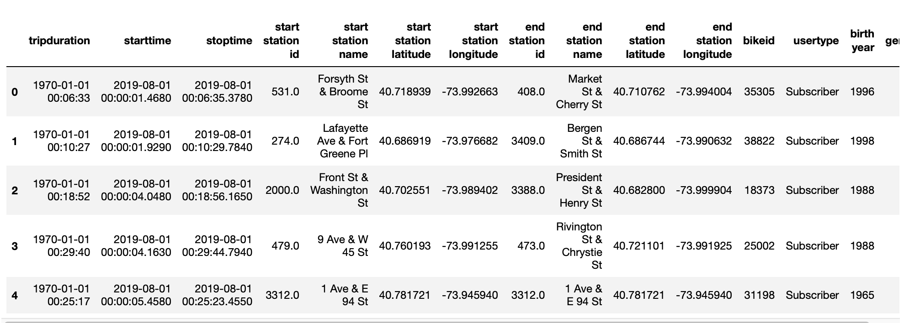
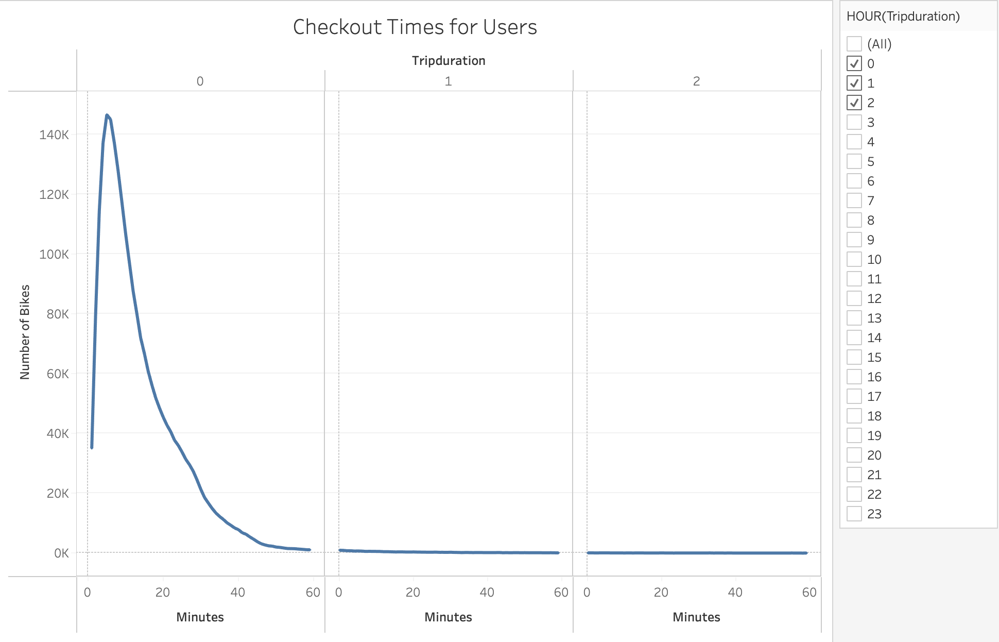
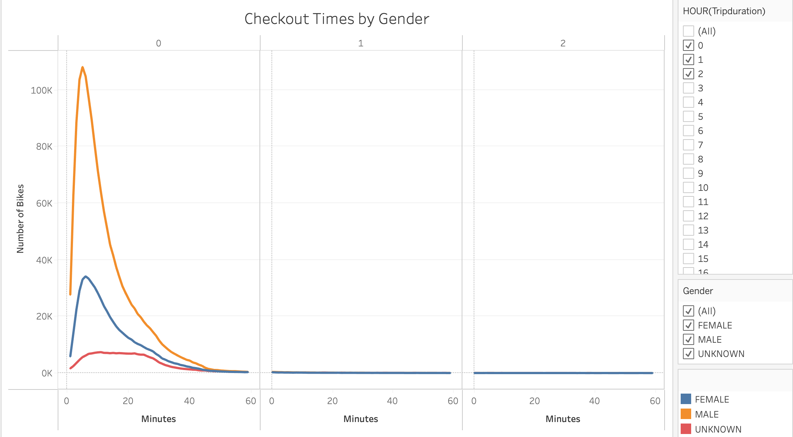
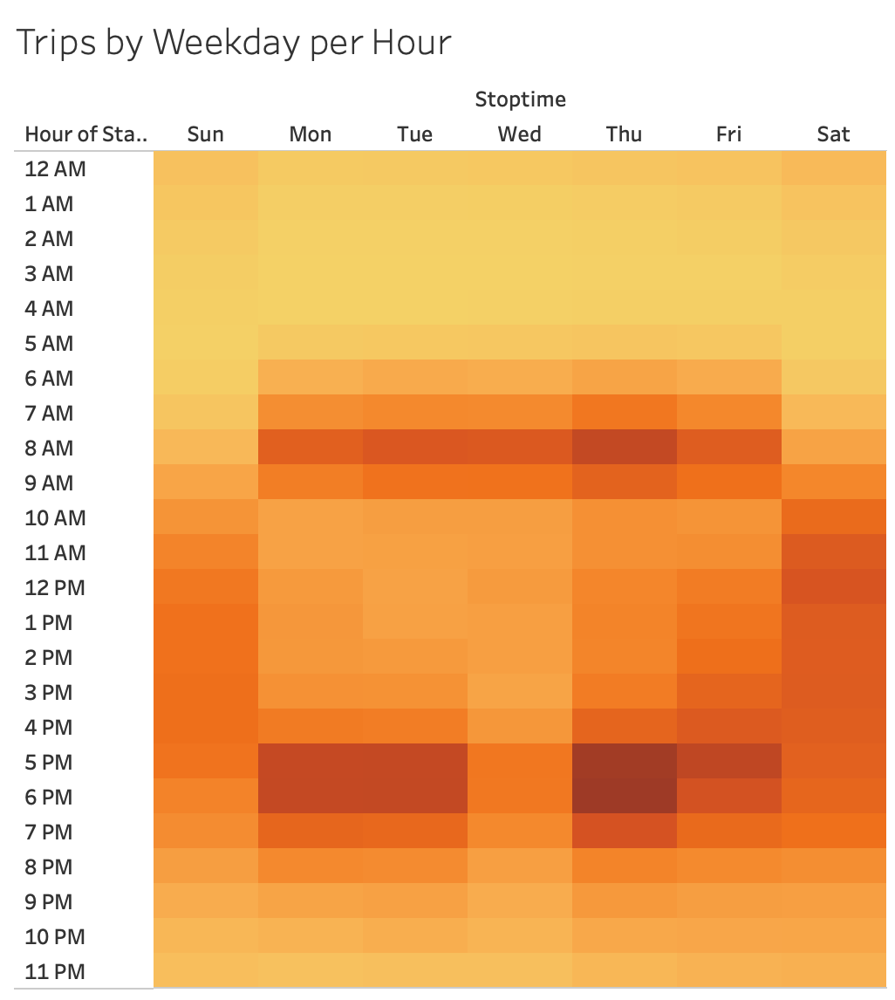
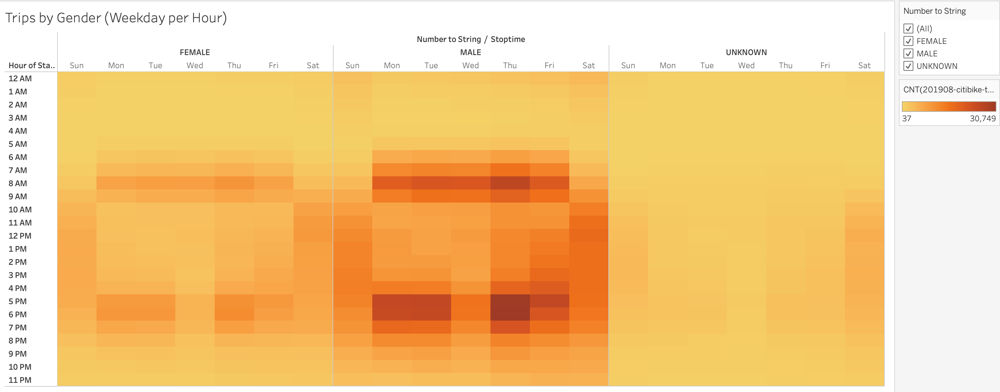
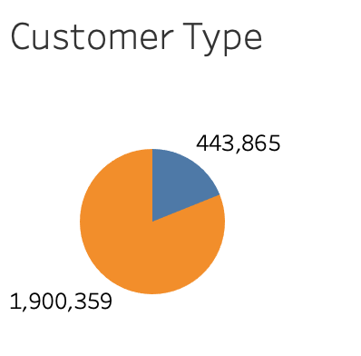
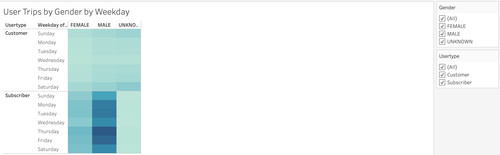
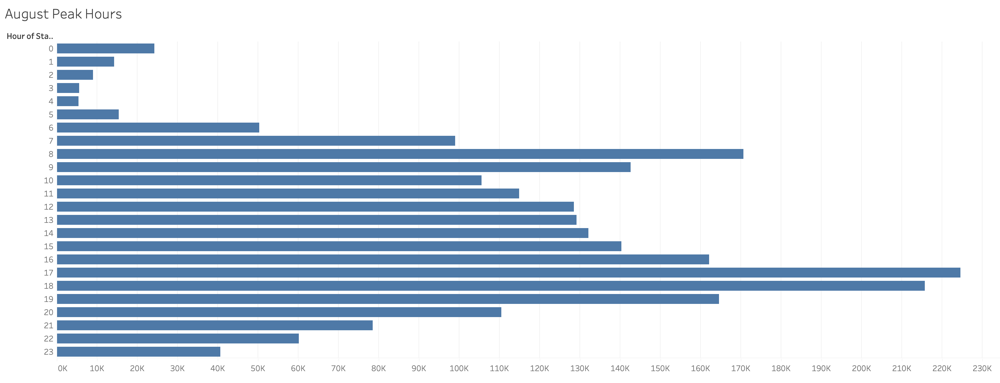

# Bike-sharing

## Overview of Project

The purpose of this project is to convince the investors that a bike-sharing program in Des Moines is a solid business proposal by providing them with data visualizations of how bike-sharing model works in NYC which helps in providing insights for potential bike-sharing investment in Des Moines. Using the CSV file data on NYC Citi Bike that is provided on the Citi Bike Website, we are required to use Tableau to create different set of visualizations for the bike trip analysis. The visualizations created should demonstrate the following data:

- The length of time that bikes are checked out for all riders and genders.
- The number of bike trips for all riders and genders for each hour of each day of the week.
- The number of bike trips for each type of user and gender for each day of the week.

## Results

This portion of the project focuses on the data visualizations that were created using Tableau. However, before creating the visualizations, Python and Pandas functions had to be used for creating a DataFrame and converting the **"tripduration"** column of the NYC Citi Bike Data CSV file from an integer to a datetime datatype for retrieving the time in hours, minutes and seconds as shown in the figure below. As a result of this, the DataFrame had to be exported as a CSV file and imported into Tableau for performing the bike trip analysis.

### Checkout Times for Users

Figure above demonstrates the length of time that bikes are checked out for all riders. As it can be seen in the graph, the vast majority of riders are renting the bikes for less than 30 minutes.

### Checkout Times by Gender

The graph displayed above, illustrates the length of time that bikes are checked out for each gender. The checked out times that are broken down by each gender are approximately equivalent among all the genders where males are making up a greater portion of the bike rentals comparing to other genders.

### Trips by Weekday for Each Hour

Figure above depicts the number of bike trips by weekday for each hour of the day as a heatmap. Looking at the concentration of trips by different hours throughout the week, it can be seen that the users tend to use the service throughout the week for commuting to work daily mostly between 6-9 AM and commuting back from work between 4-8 PM. Additionally, the service is being continuously used on Saturdays mostly between 8AM-8PM.

### Trips by Gender (Weekday per Hour)

Figure above demonstrates the number of bike trips by gender for each hour of each day of the week as a heatmap. Looking at the concentration of trips per hour for weekdays, it can be clearly seen that majority of the users are males where trips are most likely occurring between 6-9 AM and 4-8 PM on weekdays.

### Customer Type

Figure above depicts the number of short-term customers and annual subscribers to the Citi Bike service. This piece of data helps us determine types of customers we can expect for a bike-sharing company in Des Moines. As it can be seen, majority of the customers are annual subscribers which indicates that majority of users are using this service as a mean of transportation for performing their daily activities such as commuting to and from work. 

### User Trips by Gender by Weekday

The heatmap of number of trips broken down by gender and type of users for each hour for each day of the week is displayed in the figure above. As it can be seen, majority of subscribers are males indicating that they rely on bike as a transportation method throughout weekdays and weekends. Additionally, it can be seen that non-subscribers tend to be using the service mainly during the weekends for performing activities other than work.

### August Riding Hours

Figure shown above demonstrates the riding hours during August in New York City. Since August could be a good month to visit New York City, it is a good idea to identify the peak hours for bike trips during the month of August as this will help investors get a ballpark estimate of how many bikes are needed in Des Moines. As it can be seen in the bar chart, the most active time during the day in August is between 5-7 PM. Additionally, it is suggested to perform maintenance on the least active riding times which is between 2-5 AM since fewer bikes will be needed.

## Summary

In conclusion, the analysis of the bike-sharing program in New York City for the month of August 2019 was performed by creating various visualizations with the use of Tableau. Looking at the achieved results the far majority of bike users were male subscribers who were taking rides between 6-9 AM and 4-8 PM on weekdays. This implies that majority of users are using Citi Bike services as a public transportation method for commuting to and from work. 

Furthermore, it is a good idea to consider the following additional visualizations for future analysis:

- Creating a visualization that would display the number of bike trips for different months to help us identify the general trends of the bike-sharing program throughout the year, by this way we can ensure that this program is a solid business proposal year-round.

- Creating a visualization that would show case the duration of bike rental with respect to the users age, as this would help us determine which age groups tend to be taking more and longer rides.

The tableau story which is composed of all the visualizations, displayed above, in an interactive format can be viewed through the following link:
[Link to Dashboard](https://public.tableau.com/app/profile/taravat/viz/NYCCitiBikeStory_16267587697570/NYCCitiBikeStory?publish=yes)
